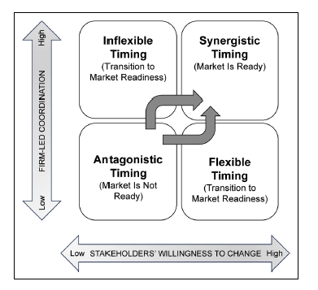
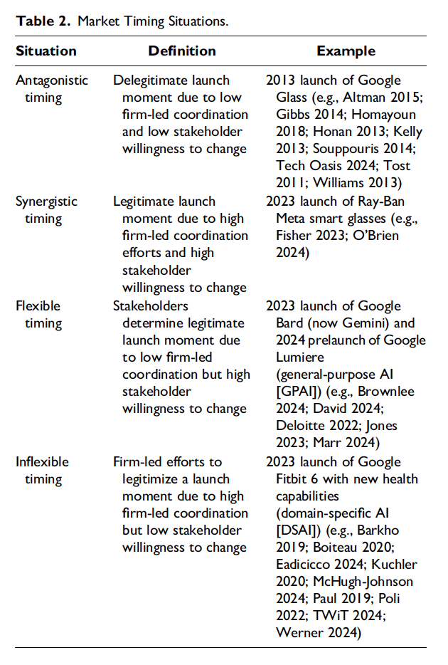

I've been involved in several product launches in the past few years, and frustratingly they've all seemed like slow burners. Despite their genuinely game changing benefits, the market has remained reluctant. The best (and most hopeful) response to these uninspiring launches have been the Gartner Hype Cycle. We're at the very early stage of a technology trigger, and exponential growth will occur!

A new paper by Thomas Derek Robinson and Ela Veresiu offers a new insight on these kind of product launches. The authors define four potential launch states:

Related to my experience, the launches I have been involved with would be placed within _Antagonistic Timing:_ an organisation that isn't quite sure about the new technologies best use-cases, who the customers might be, and how to sell them the product _and_ a set of stakeholders (mostly customers) who aren't ready or asking for the technology. The authors use the example of _Google Glass_ as an antagonistic launch, and the Apple Vision Pro and Meta's Ray-Ban glasses for more synergistic timing.

Here is their full description for the four launch scenarios:

Even more exciting is the way they chart up these multiple periods. This is a thing of beauty which should replace the _Gartner Hype Cycle:_

My main take-away from the article - although I am a total layman, and this is probably not the point of the paper - is to use communication to prime prospective audiences and lull them into believing that the market (ie: their competitors) are ready to adopt the new technology. The authors present a strategy for this. First release early demos, and don't worry about any flaws. (We've all seen TikTok videos of humanoid robots.) But crucially show pragmatic benefits of the technology that focus in five areas:

- Quality
- Efficacy
- Economic Savings
- Improved Creativity
- Entertainment

At best, the launches I have been involved in have managed to tick one of five of these lists. It's a strong reminder for the future that we can give the perception of market-readiness by focusing on all five areas.

