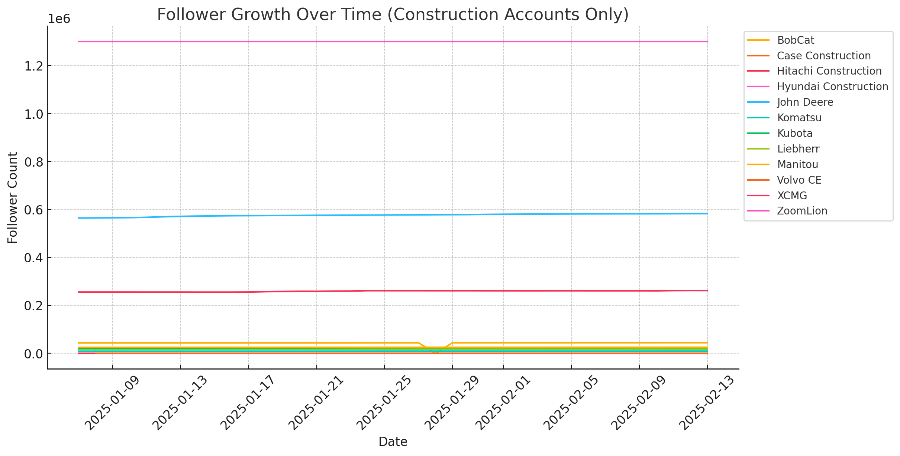
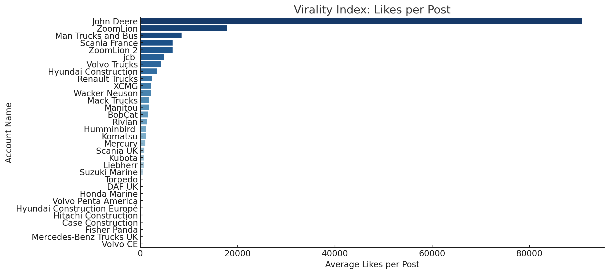

A quick addition relating to my post on January 9th about the [three challenges B2B marketers must solve in 2025](https://warm.nu/blog/post-1/) - in which I pointed out how well John Deere appeared to be doing on their TikTok account.

Although I have only collected data from a short period of time, January 7th to February 13th 2025 - the findings are revealing.

## Follower growth

The biggest winner here is John Deere, who have increased their following by 18,300 during this period. With 583,000 followers, their account is almost double that of their rival JCB (who have 299k followers)

Here's a more detailed table:

| **account_name**              | **category** | **start_followers** | **end_followers** | **total_growth** | **percentage_growth** |
| ----------------------------- | ------------ | ------------------- | ----------------- | ---------------- | --------------------- |
| ZoomLion (AltAccount)         | Construction | 1100000             | 1200000           | 100000           | 9.1                   |
| John Deere                    | Construction | 564700              | 583000            | 18300            | 3.2                   |
| Volvo Trucks                  | Trucking     | 472800              | 480400            | 7600             | 1.6                   |
| jcb                           | Construction | 293400              | 299900            | 6500             | 2.2                   |
| XCMG                          | Construction | 255600              | 261900            | 6300             | 2.5                   |
| Humminbird                    | Boating      | 42000               | 46700             | 4700             | 11.2                  |
| Scania France                 | Trucking     | 136000              | 138800            | 2800             | 2.1                   |
| Renault Trucks                | Trucking     | 26300               | 28100             | 1800             | 6.8                   |
| Mercury                       | Boating      | 91600               | 93300             | 1700             | 1.9                   |
| Liebherr                      | Construction | 15900               | 17500             | 1600             | 10.1                  |
| BobCat                        | Construction | 43700               | 44400             | 700              | 1.6                   |
| Rivian                        | Trucking     | 15000               | 15600             | 600              | 4.0                   |
| Manitou                       | Construction | 25000               | 25500             | 500              | 2.0                   |
| Scania UK                     | Trucking     | 19800               | 20200             | 400              | 2.0                   |
| Komatsu                       | Construction | 9221                | 9555              | 334              | 3.6                   |
| DAF UK                        | Trucking     | 13500               | 13700             | 200              | 1.5                   |
| Wacker Neuson                 | Trucking     | 64000               | 64200             | 200              | 0.3                   |
| Honda Marine                  | Boating      | 3027                | 3218              | 191              | 6.3                   |
| Kubota                        | Construction | 20900               | 21000             | 100              | 0.5                   |
| Volvo Penta America           | Boating      | 218                 | 279               | 61               | 28.0                  |
| Man Trucks and Bus            | Trucking     | 6964                | 7001              | 37               | 0.5                   |
| Suzuki Marine                 | Boating      | 2220                | 2256              | 36               | 1.6                   |
| Volvo CE                      | Construction | 564                 | 592               | 28               | 5.0                   |
| Mack Trucks                   | Trucking     | 2790                | 2800              | 10               | 0.4                   |
| Hyundai Construction Europé | Construction | 199                 | 205               | 6                | 3.0                   |
| Mercedes-Benz Trucks UK       | Trucking     | 257                 | 263               | 6                | 2.3                   |
| Case Construction             | Construction | 242                 | 247               | 5                | 2.1                   |
| Hitachi Construction          | Construction | 40                  | 43                | 3                | 7.5                   |
| Torpedo                       | Boating      | 1485                | 1487              | 2                | 0.1                   |
| Fisher Panda                  | Boating      | 4                   | 5                 | 1                | 25.0                  |
| Hyundai Construction          | Construction | 19800               | 19800             | 0                | 0.0                   |

If you go ahead and look at the average likes per post, John Deere are well ahead, not just of their industry - heavy machinery - but also other adjacent industries such as trucking and marine technology.

Advertising cannot have an impact if audience fail to attribute it to the correct brand. Surprisingly, literature suggests that more than half of all advertisements fail to make a clear link between the message and the brand. "Xero with an X" is a clever way of getting audiences to remember the brand.

However, what is perhaps most surprising is that the advert itself first aired at least three years ago. Yet it’s still finding a new audience today.
