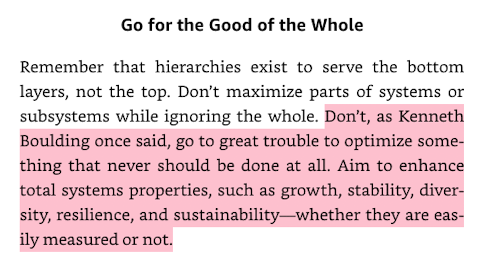

I've just finished a wonderful short book, a primer on systems thinking by Donella H Meadows called 'Thinking in Systems'. One passage in the book is a stark reminder of the fallacy of social media metrics. It's better to focus on the strategy (or the system) than to focus on the individual feedback that the social media system provides.

